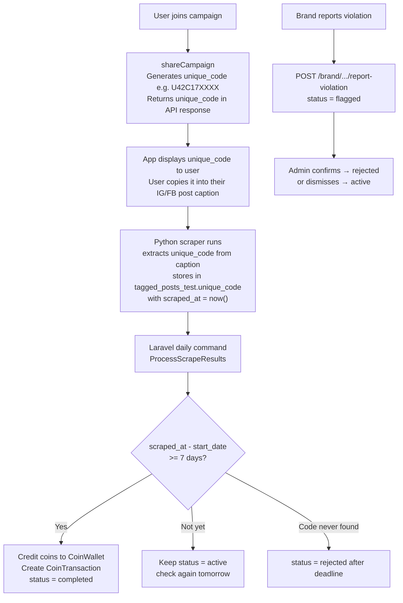

# Post Verification & Coin Reward Flow

## Current State

- User calls `POST /user/share-campaign/{id}` → creates `CampaignTransaction` (status=`active`, `start_date` already saved)
- Scrapers write to `tagged_posts_test` (IG) and `facebook_posts_test` (FB) with a `scraped_at` field
- No scheduled Laravel commands exist yet

---

## Core Idea: Unique Code

When a user joins a campaign, a **unique code** is generated and saved on the `CampaignTransaction`. The user includes this code in their post caption. The scraper extracts the code from the caption and stores it in the scraped posts table. Laravel then matches the code and checks:

```
scraped_at  -  start_date  >=  7 days  →  reward coins
```

---

## Architecture Overview



---

## Phase 1 — Unique Code Generation on Campaign Join

**Where:** [`app/Http/Controllers/Api/User/DashboardController.php`](app/Http/Controllers/Api/User/DashboardController.php) — `shareCampaign` method

**Changes:**
- Generate a unique code on join. Format: `U{user_id}C{campaign_id}` + short random suffix (e.g. `U42C17A3F9`) — short enough to paste in a caption
- Save `unique_code` to `campaign_transaction`
- **Return `unique_code` in the API response** so the app displays it to the user at post-creation time
- Status is already set to `active` — no change needed there

**New migration:** Add `unique_code` varchar column to `campaign_transactions`

> The app shows the unique code to the user after joining, and the user pastes it into their Instagram/Facebook post caption before posting.

---

## Phase 2 — Scraped Posts Tables Get `unique_code`

The scraper (Python — implementation deferred) will parse post captions, extract the unique code pattern, and store it.

**New migrations:**
- Add `unique_code` varchar nullable column to `tagged_posts_test`
- Add `unique_code` varchar nullable column to `facebook_posts_test`

This is the only DB-side change needed for scraper integration. The Python logic to extract and populate this field is out of scope for now.

---

## Phase 3 — Laravel Artisan Command: `ProcessScrapeResults`

**File:** New `app/Console/Commands/ProcessScrapeResults.php`

**Logic (runs daily):**

1. Query all `CampaignTransaction` with `status = 'active'`
2. For each transaction, look up its `unique_code` in `tagged_posts_test` OR `facebook_posts_test` (based on `shared_on` field):
   ```sql
   SELECT scraped_at FROM tagged_posts_test WHERE unique_code = ? ORDER BY scraped_at DESC LIMIT 1
   ```
3. **If found:** check `scraped_at - start_date >= 7 days`
   - Yes → credit coins:
     - `CoinWallet.balance += campaign.reward_per_user`
     - Create `CoinTransaction` (type=`credit`, campaign_id, description="Campaign reward")
     - Set `CampaignTransaction.status = 'completed'`
   - Not yet → leave as `active`, will check again tomorrow
4. **If not found** AND `end_date < today` (deadline passed with no post) → set `status = 'rejected'`
5. Skip transactions with `status = 'flagged'` (pending admin review)

---

## Phase 4 — Brand Violation Reporting

**New endpoint:** `POST /brand/campaign-transaction/{id}/report-violation`

- Accepts optional `reason` text
- Validates `CampaignTransaction.campaign_id` belongs to the authenticated brand
- Sets `status = 'flagged'`, stores `violation_reason`
- Admin reviews and either confirms (`rejected`) or dismisses (`active`)

**File:** New method in [`app/Http/Controllers/Api/Seller/SellerDashboardController.php`](app/Http/Controllers/Api/Seller/SellerDashboardController.php)
**Route:** Add to [`routes/api.php`](routes/api.php) under `brand` auth group

**New migration:** Add `violation_reason` text nullable to `campaign_transactions`

---

## Phase 5 — Laravel Scheduler

**File:** [`routes/console.php`](routes/console.php)

```php
Schedule::command('campaign:process-results')->dailyAt('06:00');
```

---

## `campaign_transactions.status` State Machine

```
active ──────────────────────────────────→ completed  (scraped_at - start_date >= 7d, coins credited)
  │
  ├── [deadline passed, code never found] → rejected
  ├── [brand flags] ──→ flagged ──────────→ rejected  (admin confirms)
  │                          └────────────→ active     (admin dismisses)
```

---

## Summary of New Files / Changes

- **New migrations:**
  - Add `unique_code` to `campaign_transactions`
  - Add `unique_code` to `tagged_posts_test` and `facebook_posts_test`
  - Add `violation_reason` to `campaign_transactions`
- **Modified:** `shareCampaign` in [`app/Http/Controllers/Api/User/DashboardController.php`](app/Http/Controllers/Api/User/DashboardController.php) — generate and save `unique_code`
- **New command:** `app/Console/Commands/ProcessScrapeResults.php`
- **Modified:** [`app/Http/Controllers/Api/Seller/SellerDashboardController.php`](app/Http/Controllers/Api/Seller/SellerDashboardController.php) — add `reportViolation`
- **Modified:** [`routes/api.php`](routes/api.php) — new violation endpoint
- **Modified:** [`routes/console.php`](routes/console.php) — daily scheduler
- **Python (deferred):** Scraper extracts `unique_code` from post captions and stores it in scraped tables
